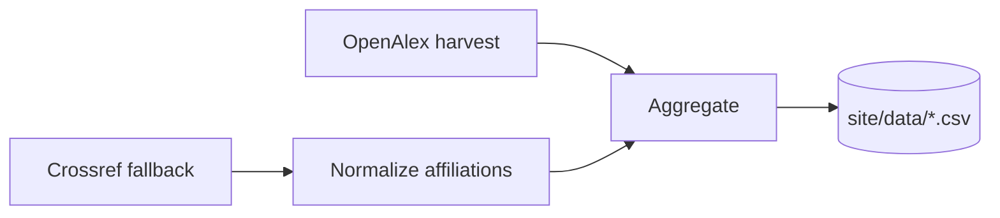

<div align="center">

# ECERankings.org

*A metrics-based ranking of Electrical & Computer Engineering programs, built on [OpenAlex](https://openalex.org) instead of DBLP.*


</div>

---

Modeled on [CSRankings](https://csrankings.org), but built for how ECE
actually publishes: journal-heavy and IEEE/Optica-centric. [Crossref](https://www.crossref.org)
fills the gaps where OpenAlex's conference coverage lags.

> **Pre-launch.** The venue registry, harvesting pipeline, and aggregation
> work end-to-end; the public site does not exist yet. Full methodology and
> roadmap: [PLAN.md](PLAN.md).

## Methodology

The ranking is deliberately simple, auditable, and hard to game:

- **Adjusted counts** — each paper is worth 1.0, split evenly across its
  authors (1/N each). An institution's credit in an area is the sum of its
  authors' shares. No citations, no impact factors — just publication counts
  at selective venues.
- **Geometric-mean scoring** — an institution's overall score is the
  geometric mean of (1 + adjusted count) across the areas you select,
  rewarding breadth over single-area dominance (same formula as CSRankings).
- **Curated venues only** — a venue is included only if it is both highly
  selective and ≳80% in-scope for its area, so every counted paper is
  auditable. The registry lives in [`data/areas.json`](data/areas.json).
- **Affiliation at publication time** (default) — papers are credited to the
  institution the author listed *on that paper*, not their current employer.
  A CSRankings-style "current faculty" mode is planned as a toggle.
- **Universities only** — OpenAlex `type=education` filtering drops corporate
  research labs.

## Areas

19 areas mirroring how ECE departments organize, from Circuits & VLSI through
Semiconductor Devices, Power & Energy, Communications, Photonics, Control, and
Robotics, plus optional CS-overlap areas (Architecture, ML, Vision) and an
optional "Nature family" tier. Full taxonomy and venue-inclusion policy: [PLAN.md](PLAN.md).

## Pipeline



| Path | What it is |
|---|---|
| `PLAN.md` | Architecture, methodology, and phased roadmap — read this first |
| `data/areas.json` | **The venue registry** — every ranked venue with its OpenAlex source IDs, per-year availability, and verification status. The project's most important curated file. |
| `data/affiliation-map.csv` | Curated map from raw Crossref affiliation strings to OpenAlex institutions |
| `data/reports/` | One markdown report per data-collection run |
| `pipeline/` | Harvest (OpenAlex + Crossref fallback), affiliation normalization, adjudication, and aggregation scripts — Python stdlib only, no dependencies |
| `site/data/` | Generated CSVs the future static frontend will consume |
| `.claude/skills/` | Project integrations for Claude Code (collect-venue-data, adjudicate-affiliations) |
| `cache/` | Raw API responses (gitignored; safe to delete and re-harvest) |

## Running the pipeline

Requirements: Python 3 (standard library only — nothing to install) and an
OpenAlex API key in a `.env` file at the repo root:

```
OPENALEX_API_KEY=your-key-here
```

```bash
# 1. Harvest works for a registered venue-year (OpenAlex)
python3 pipeline/harvest.py --venue jssc --year 2023

# 2. For conference years OpenAlex lacks, fall back to Crossref
python3 pipeline/harvest_crossref.py --venue iedm --year 2024

# 3. Resolve Crossref free-text affiliations to institutions
python3 pipeline/normalize_affiliations_local.py

# 4. Aggregate into per-(institution, area, year) adjusted counts
python3 pipeline/aggregate.py
```

Each script has a detailed docstring with more options. Harvests are cached
under `cache/<venue>/<year>/` and fully resumable.

Note: `data/institutions.json` (a ~29 MB OpenAlex institutions dump used for
local affiliation matching) is gitignored; see
`pipeline/normalize_affiliations_local.py` for how to regenerate it.

## Data sources & acknowledgments

- **[OpenAlex](https://openalex.org)** — primary bibliographic source
  (works, authorships, resolved institutions).
- **[Crossref](https://www.crossref.org)** — fallback for recent conference
  years OpenAlex hasn't yet linked to a source.
- **[CSRankings](https://csrankings.org)** by Emery Berger et al. — the
  methodological blueprint this project adapts for ECE.

## Contributing

The highest-leverage contribution right now is venue curation: auditing
entries in `data/areas.json` (statuses: `todo` → `candidate` → `verified`)
and flagging wrong source IDs or missing years. Open an issue with the venue
key and the evidence.
