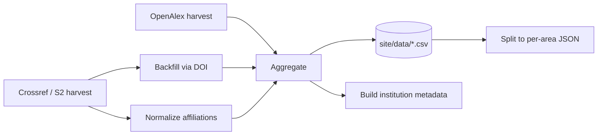

<div align="center">

# ECERankings.org

*A metrics-based ranking of Electrical & Computer Engineering programs, built on [OpenAlex](https://openalex.org) and [Crossref](https://www.crossref.org).*


</div>

---

Methodology modeled on [CSRankings](https://csrankings.org), adapted for ECE
publication patterns (journal-heavy, IEEE/Optica-centric). Primary data
source is [OpenAlex](https://openalex.org); [Crossref](https://www.crossref.org)
serves as a fallback for conference years not yet indexed by OpenAlex.

> **Pre-launch.** Venue registry, harvesting, and aggregation are functional
> end to end. The public site has not been built. Methodology and roadmap:
> [PLAN.md](PLAN.md).

## Methodology

- **Adjusted count.** Each paper contributes 1.0, divided evenly among its
  N authors (1/N per author). An institution's credit in an area is the sum
  of its authors' shares. No citations, no impact factors — publication
  count at qualifying venues only.
- **Overall score.** Geometric mean of (1 + adjusted count) across the
  selected areas — identical formula to CSRankings.
- **Venue inclusion.** A venue qualifies only if it is highly selective and
  ≥80% in-scope for its area. Registry: [`data/areas.json`](data/areas.json).
- **Attribution.** Default mode credits each paper to the institution listed
  at time of publication, not current affiliation. A "current faculty" mode
  is planned, not yet implemented.
- **Institution filter.** OpenAlex `type=education` restricts results to
  universities; corporate research labs are excluded.

## Areas

20 areas (18 on by default), structured to match ECE departmental organization: Circuits &
VLSI, Semiconductor Devices, Power & Energy, Communications, Photonics,
Control, Robotics, plus optional CS-overlap areas (Architecture, ML,
Vision). Full taxonomy and inclusion criteria: [PLAN.md](PLAN.md).

## Pipeline



Crossref and Semantic Scholar know which venue a paper belongs to but carry
sparse affiliations; OpenAlex has the affiliations but leaves most IEEE
conference papers linked to no venue at all. The backfill step joins the two
on DOI.

| Path | Description |
|---|---|
| `PLAN.md` | Architecture, methodology, and phased roadmap. |
| `data/areas.json` | Venue registry — OpenAlex source IDs, per-year availability, and verification status for every ranked venue. |
| `data/affiliation-map.csv` | Mapping from raw Crossref affiliation strings to OpenAlex institution IDs. |
| `data/excluded-works.csv` | Curated list of non-research works (editorials, columns) that `aggregate.py` skips. |
| `data/reports/` | One report per data-collection run. |
| `pipeline/` | Harvest, backfill, normalization, adjudication, and aggregation scripts. Python standard library only, except `normalize_semantic.py`. |
| `site/data/` | Generated CSVs and JSON consumed by the frontend. |
| `.claude/skills/` | Claude Code project integrations. |
| `cache/` | Raw API responses. Tracked via Git LFS so it syncs across machines. |

## Running the pipeline

Requirements: Python 3 (standard library only) and an OpenAlex API key in a
`.env` file at the repo root:

```
OPENALEX_API_KEY=your-key-here
```

```bash
# 1. Harvest works for a registered venue-year (OpenAlex)
python3 pipeline/harvest.py --venue jssc --year 2023

# 2. For conference years OpenAlex lacks, fall back to Crossref
python3 pipeline/harvest_crossref.py --venue iedm --year 2024

# 3. Recover affiliations for Crossref/S2 works by DOI lookup.
#    Always measure before writing: --pilot probes a random sample read-only.
python3 pipeline/backfill_openalex.py --pilot 500
python3 pipeline/backfill_openalex.py --apply

# 4. Resolve any remaining free-text affiliations to institutions.
#    These are ALTERNATIVES writing the same file — run one, not both.
.venv/bin/python pipeline/normalize_semantic.py --all-cached  # preferred
# or, with no .venv available:
python3 pipeline/normalize_affiliations_local.py --all-cached

# 5. Propose non-research works (editorials, columns) for exclusion.
#    Writes proposals only — promote accepted rows into data/excluded-works.csv,
#    which is the file aggregate.py reads. Nothing is excluded automatically.
.venv/bin/python pipeline/detect_editorials.py --venue scirobotics

# 6. Aggregate into per-(institution, area, year) adjusted counts
python3 pipeline/aggregate.py --all-cached

# 7. Split for the frontend, and build institution metadata
python3 pipeline/split.py
python3 pipeline/build_institutions.py

# 8. Check for regressions
python3 pipeline/verify.py --all
```

Each script's docstring documents the full option set. Harvests are cached
under `cache/<venue>/<year>/`; re-runs and backfills are idempotent. The
backfill checkpoints per batch to `cache/.backfill-checkpoint.jsonl`, so an
interrupted run resumes instead of re-spending the API budget, and records
fruitless DOIs in `cache/.backfill-negative.txt` so they are never re-queried.

`data/institutions.json` (~27 MB, an OpenAlex institutions dump used by
`normalize_affiliations_local.py`) is gitignored. Not to be confused with
`site/data/institutions.json`, which is the small name+country file the
frontend loads and `build_institutions.py` generates.

## Data sources & acknowledgments

- **[OpenAlex](https://openalex.org)** — primary bibliographic source
  (works, authorships, resolved institutions).
- **[Crossref](https://www.crossref.org)** — fallback source for conference
  years not yet linked in OpenAlex.
- **[CSRankings](https://csrankings.org)**, by Emery Berger et al. — the
  methodology this project adapts for ECE.

## Contributing

Current priority: venue-registry curation. Entries in `data/areas.json` are
marked `todo`, `candidate`, or `verified`. Review `todo`/`candidate` entries
for correct source IDs and year coverage; open an issue or PR referencing
the venue key.
